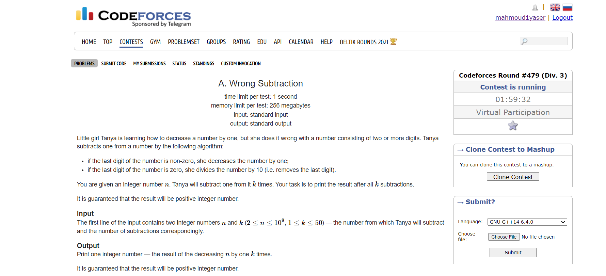
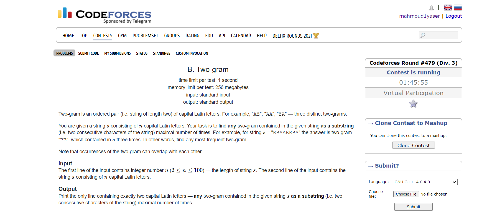
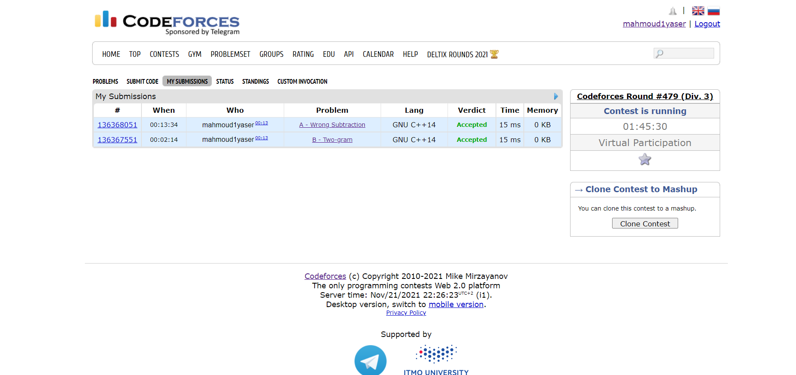

# CMP2241_Task 2 --> Codeforces Contests

## Codeforces handler "username": mahmoud1yaser
## Name: Mahmoud Yaser Salman
## Sec: 2
## B.N.: 29


## Problems
### A. Wrong Subtraction

### B. Two-gram

### Solution_Screenshot



### Code_A. Wrong Subtraction
```
using namespace std; 
int main()
{
int n,k; // initialization of the inputs.
cin>>n>>k;
for(int i =0; i<k;i++) //Make a for loop to get over the code with 'k' time.
{
int lastDigit = n%10; //lastDigit will store the last digit of the integer n.
if (lastDigit != 0)
n--;
else n = n / 10;
}
cout<<n<<endl;
}
```

### Code_B. Two-gram
```
#include<iostream>
using namespace std;

string origStr;
/*First we will make a function which will iterate over all the inputted string 
to find pattern and increment the variable "cnt".
*/

int call(string sub){
int cnt=0,max=0;
for(int i=0;i<origStr.size()-1;i++){
if(origStr[i]==sub[0] && origStr[i+1]==sub[1])
cnt++;
}
return cnt;
}

//Second we will walk through our main to execute the normal code where we will enter the inputs.


int main()
{
int max=0; //"max" will store the maximum value of "cnt"
int n; //"n" will store the number of the inputted characters
string gramStr; //"gramStr" will store the gram string
cin>>n;
cin>>origStr;
for(int i=0;i<n-1;i++){
string subStr= origStr.substr(i,2); //substr(index, length)
int temp= call(subStr);
if(temp>max) //here is to check to get the most repeated pattern
{
max= temp;
gramStr= subStr;
}
}
cout<<gramStr<<endl;
}
```
